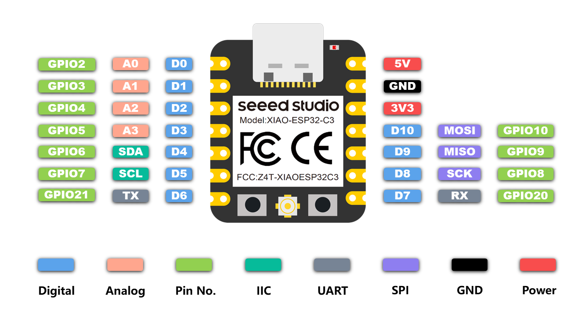
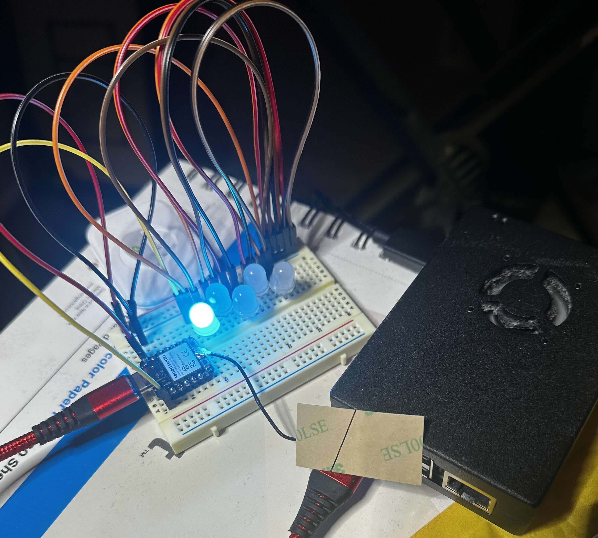

WebLight
========

<!-- markdown-toc start - Don't edit this section. Run M-x markdown-toc-refresh-toc -->
**Table of Contents**

- [WebLight](#weblight)
- [Reference information](#reference-information)
    - [Neopixels](#neopixels)
        - [Through-hole LED form-factor pinout](#through-hole-led-form-factor-pinout)
    - [XIAO ESP32-C3](#xiao-esp32-c3)
        - [Pinout](#pinout)
- [Purchasing links](#purchasing-links)
    - [Batteries](#batteries)
    - [NeoPixels](#neopixels)
        - [The ones that ended up working well:](#the-ones-that-ended-up-working-well)
        - [Untried ones](#untried-ones)
        - [Other links:](#other-links)
    - [XIAO ESP32C3](#xiao-esp32c3)
- [ESP-IDF](#esp-idf)
    - [Links](#links)
    - [Creating a new esp-idf project from scratch](#creating-a-new-esp-idf-project-from-scratch)
    - [Running a project](#running-a-project)
    - [Monitoring](#monitoring)
        - [With `idf.py`](#with-idfpy)
        - [With `emacs`](#with-emacs)
        - [Discovering the port](#discovering-the-port)
- [Sources / Acknowledgements](#sources--acknowledgements)

<!-- markdown-toc end -->


This is an attempt to recreate the simple and cheap XIAO ESP32-C3 /
NeoPixel light seen in [bleeptrack](https://www.bleeptrack.de/)'s
[paper stars video](https://www.youtube.com/watch?v=MRfAjHKRlBU).

They were kind enough to
[reply on mastodon](https://hachyderm.io/@zellyn/111621948922719858) with
hardware details, thus kick-starting my first ESP32 programming attempt.
Apparently I can still solder a bit. Who knew?

# Reference information

## Neopixels

### Through-hole LED form-factor pinout


## XIAO ESP32-C3

### Pinout


# Purchasing links

## Batteries
It seems that 3.7V LiPo batteries are fairly standard for hobby use,
and will drive neopixels. "1S" is a single cell, the most basic
configuration. [This brushlesswhoop.com
post](https://brushlesswhoop.com/blog/battery-specifications/) has a
primer on LiPo batteries.

These are cheap, and either have fragile connectors, or I haven't managed to find matching connectors yet:
- Amazon: 1S LiPo batteries x5 for $16 with charger: https://www.amazon.com/dp/B0CHFG457D
- These connectors DID NOT FIT (they just broke off the pins):
  https://www.amazon.com/gp/product/B08H7WZJND -- if anyone knows how
  to match those cheap batteries with the correct connectors, please
  tell me.

## NeoPixels

### The ones that ended up working well:

- adafruit NeoPixel Diffused 8mm Through-Hole LED - 5 Pack: https://www.adafruit.com/product/1734
- adafruit NeoPixel Diffused 5mm Through-Hole LED - 5 Pack: https://www.adafruit.com/product/1938

### Untried ones

These were too small for me to solder:

- adafruit 10x neopixel for $4.50: https://www.adafruit.com/product/1655

I haven't tried cheap strips of WS2812/WS2812B-compatible LEDs, like this:

- Amazon: Strip of 60 for $9.99: [link](https://www.amazon.com/dp/B01CDTED80)

### Other links:

- Instructable: https://www.instructables.com/Getting-Started-With-NeoPixle-WS2812-RGB-LED/
- Tim's blog: https://cpldcpu.wordpress.com/category/led/
- https://hackaday.com/2017/01/25/ws2812b-led-clones-work-better-than-originals/
- https://learn.adafruit.com/adafruit-neopixel-uberguide/the-magic-of-neopixels

## XIAO ESP32C3

The [XIAO ESP32C3](https://www.seeedstudio.com/Seeed-XIAO-ESP32C3-p-5431.html)
is notable for having an integrated battery controller: you can solder
the leads of a 1S LiPo battery to the pads, and it will charge it and
use it for power.

- Excellent seeed studio [XIAO ESP32C3 Getting Started Guide](https://wiki.seeedstudio.com/XIAO_ESP32C3_Getting_Started/)
- sigmdel.ca evaluation: [link](https://sigmdel.ca/michel/ha/xiao/xiao_esp32c3_intro_en.html)

# ESP-IDF

## Links

- IDF (IoT Development Framework) homepage with chip choice: https://idf.espressif.com/
- ESP32-C3 Getting started: [link](https://docs.espressif.com/projects/esp-idf/en/stable/esp32c3/get-started/index.html)
- Component registry: https://components.espressif.com/
  - led_strip: [link](https://components.espressif.com/components/espressif/led_strip/versions/2.5.3)
  - API Guides » Tools » IDF Component Manager: [link](https://docs.espressif.com/projects/esp-idf/en/stable/esp32c3/api-guides/tools/idf-component-manager.html)
  - IDF Component Manager and ESP Component Registry Documentation: [link](https://docs.espressif.com/projects/idf-component-manager/en/latest/)

## Creating a new esp-idf project from scratch

It's easiest to copy and modify examples, but it's not always obvious
what's necessary and what's not. Creating a new project from scratch
is easy.

```shell
idf.py create-project weblight
cd weblight
idf.py add-dependency "espressif/led_strip^2.5.3"
idf.py set-target esp32c3

echo build/ managed_components/ sdkconfig.old | tr ' ' '\n' >> .gitignore
echo sdkconfig >> .gitignore # Good idea?

git init .
git checkout -b main
```

## Running a project

```shell
# Configure the Wifi details under "Weblight"
idf.py menuconfig
idf.py build
idf.py flash
```

## Monitoring

### With `idf.py`

`idf.py monitor` will monitor the ESP32-C3 serial console. It's a
little tricky to get out of, since it's passing most keypresses
through. The command prefix is `ctrl-t`:

- help: `ctrl-t` `ctrl-h`
- exit: `ctrl-t` `ctrl-x`

### With `emacs`

`M-x serial-term` will create a new serial terminal.

- Serial port: /dev/ttyA[TAB]
- Baud: 115200

`C-c` is the command prefix. For example, to do a normal `M-x` command, type `C-c` `M-x`.

### Discovering the port

At least on my Raspberry Pi, I could find it with `ls /dev/ttyA*` --
it's the only thing named that way. Fortunately, `idf.py flash` and
`idf.py monitor` seem to usually be able to figure out the port.

# Sources / Acknowledgements

- `led_strip` code copied from [led_strip/examples/.../led_strip_rmt_ws2812_main.c](https://github.com/espressif/idf-extra-components/blob/master/led_strip/examples/led_strip_rmt_ws2812/main/led_strip_rmt_ws2812_main.c)
- HSV conversion copied from [examples/peripherals/rmt/led_strip/main/led_strip_example_main.c](https://github.com/espressif/esp-idf/blob/master/examples/peripherals/rmt/led_strip/main/led_strip_example_main.c)
- wifi code copied from [examples/wifi/getting_started/station/main/station_example_main.c](https://github.com/espressif/esp-idf/blob/v5.2.1/examples/wifi/getting_started/station/main/station_example_main.c)
- webserver code copied from [examples/protocols/http_server/simple/main/main.c](https://github.com/espressif/esp-idf/blob/master/examples/protocols/http_server/simple/main/main.c)
- url encode/decode copied from [examples/common_components/protocol_examples_common/protocol_examples_utils.c](https://github.com/espressif/esp-idf/blob/master/examples/common_components/protocol_examples_common/protocol_examples_utils.c)
- hsv conversion code copied from [examples/peripherals/rmt/led_strip/main/led_strip_example_main.c](https://github.com/espressif/esp-idf/blob/master/examples/peripherals/rmt/led_strip/main/led_strip_example_main.c)

# Log

## Getting a simple LED chaser to work


